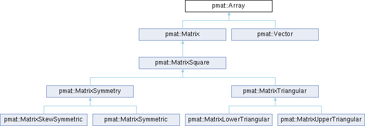
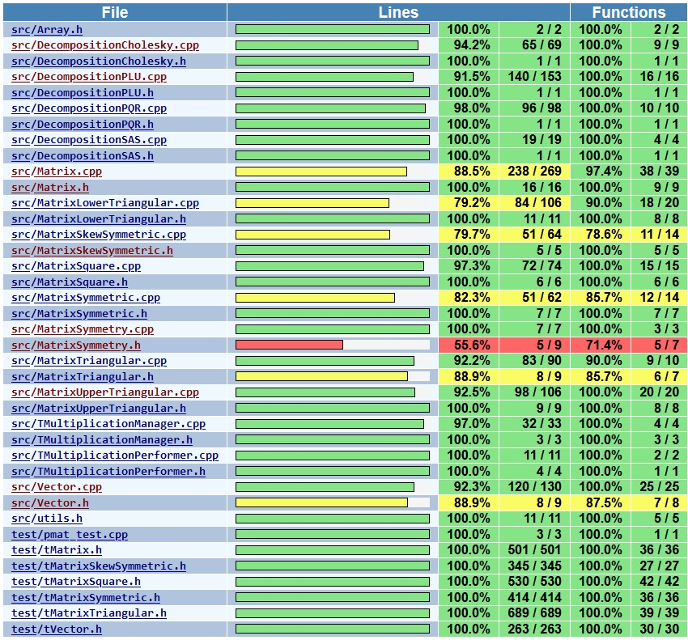

# pmat: A Simple C++ Library for Matrix Operations

This is the repository of the C++ source code of a static library for basic operations with matrices, including some matrix decompositions (PLU, PQR, etc.) which enable the solution of linear systems and the calculation of important magnitudes such as determinants, inverse matrices, rank and others. The library currently provides a multithreaded version for matrix multiplication aiming to implement in the near future more operations and magnitudes in their multithreaded versions.

This effort is also the Capstone Project (Option One) submitted by the author to his Udacity C++ Nanodegree Course as the final work to be evaluated.

## Rubric Points Implemented

| RUBRIC                      | POINT                                                                                          | EXAMPLE FILE               | LINE NUMBER(S)       |
| --------------------------- | ---------------------------------------------------------------------------------------------- | -------------------------- | -------------------- |
| Loops, Functions, I/O       | The project demonstrates an understanding of C++ functions and control structures.             | DecompositionPLU.cpp       | 32-60                |
| Loops, Functions, I/O       | The project reads data from a file and process the data, or the program writes data to a file. | Matrix.cpp                 | 50-70                |
| Object Oriented Programming | The project uses Object Oriented Programming techniques.                                       | Matrix.h                   | 1-304                |
| Object Oriented Programming | Classes use appropriate access specifiers for class members.                                   | Matrix.h                   | 1-304                |
| Object Oriented Programming | Class constructors utilize member initialization lists.                                        | Matrix.h                   | 31-33                |
| Object Oriented Programming | Classes abstract implementation details from their interfaces.                                 | DecompositionPLU.h         | 104-113              |
| Object Oriented Programming | Classes abstract implementation details from their interfaces.                                 | DecompositionPQR.h         | 1-81                 |
| Object Oriented Programming | Classes follow an appropriate inheritance hierarchy.                                           | MatrixTriangular.h         | 12,29,31             |
| Object Oriented Programming | Overloaded functions allow the same function to operate on different parameters.               | Matrix.h                   | 212,222              |
| Object Oriented Programming | Derived class functions override virtual base class functions.                                 | Array.h, Matrix.h          | 28(Array),38(Matrix) |
| Memory Management           | The project makes use of references in function declarations.                                  | Matrix.h                   | 58                   |
| Memory Management           | The project follows the Rule of 5.                                                             | MatrixUpperTriangular.h    | 16-23                |
| Memory Management           | The project uses move semantics to move data, instead of copying it, where possible.           | MatrixSquare.cpp           | 11                   |
| Memory Management           | The project uses smart pointers instead of raw pointers.                                       | TMultiplicationManager.h   | 21                   |
| Concurrency                 | The project uses multithreading.                                                               | TMultiplicationManager.cpp | 42                   |
| Concurrency                 | A promise and future is used in the project.                                                   | TMultiplicationManager.cpp | 39                   |
| Concurrency                 | A mutex or lock is used in the project.                                                        | TMultiplicationManager.cpp | 18,23                |

## Documentation

The content of documentation directory was generated by [doxygen](https://www.doxygen.nl/) outputted to html and pdf. In the html version, [MathJax](https://www.mathjax.org/) was used to draw the [Latex](https://www.latex-project.org/) commands. Additionally to the usual description of data, functions and classes, the generated documentation also presents class diagrams such as the following, in which the hierarchy of matrix classes is shown.

  

## Development

The library pmat was developed in Windows 10 using the following gear.

* Editor: [vscode](https://code.visualstudio.com/) 1.81.0
* Compiler: [Clang](https://clang.llvm.org/) 16.0.5
* Builder: [cmake](https://cmake.org/) 3.27.1
* Generator: [ninja](https://ninja-build.org/) 1.11.1
* Language server: [clangd](https://clangd.llvm.org/) 16.0.5
* Test library: [gtest](https://github.com/google/googletest/archive/refs/tags/v1.13.0.zip) 1.13.0 (downloaded automatically by cmake)
* Package manager: [msys2](https://www.msys2.org/)

The source code also compiled successfully in Linux and Windows environments by using cmake, make and gcc as described in the next section. For old versions of gcc (around 5.4), "-Wno-attributes" should be used.

## Dependencies for Running Locally

* cmake >= 3.7
  * All OSes: [click here for installation instructions](https://cmake.org/install/)
* make >= 4.1 (Linux, Mac), 3.81 (Windows)
  * Linux: make is installed by default on most Linux distros
  * Mac: [install Xcode command line tools to get make](https://developer.apple.com/xcode/features/)
  * Windows: [Click here for installation instructions](http://gnuwin32.sourceforge.net/packages/make.htm)
* gcc/g++ >= 5.4
  * Linux: gcc / g++ is installed by default on most Linux distros
  * Mac: same deal as make - [install Xcode command line tools](https://developer.apple.com/xcode/features/)
  * Windows: recommend using [MinGW](http://www.mingw.org/)

## Test coverage

In order to enable the evaluation of the library, unit gtests were developed and their coverage were verified by  [gcovr](https://gcovr.com/en/stable/) outputted to html in the coverage directory.

  

## Basic Build Instructions

1. Clone this repo.
2. Make a build directory in the top level directory: `mkdir build && cd build`
3. Compile: `cmake .. && make`
4. Run it: `/test/pmat_test.exe`.
